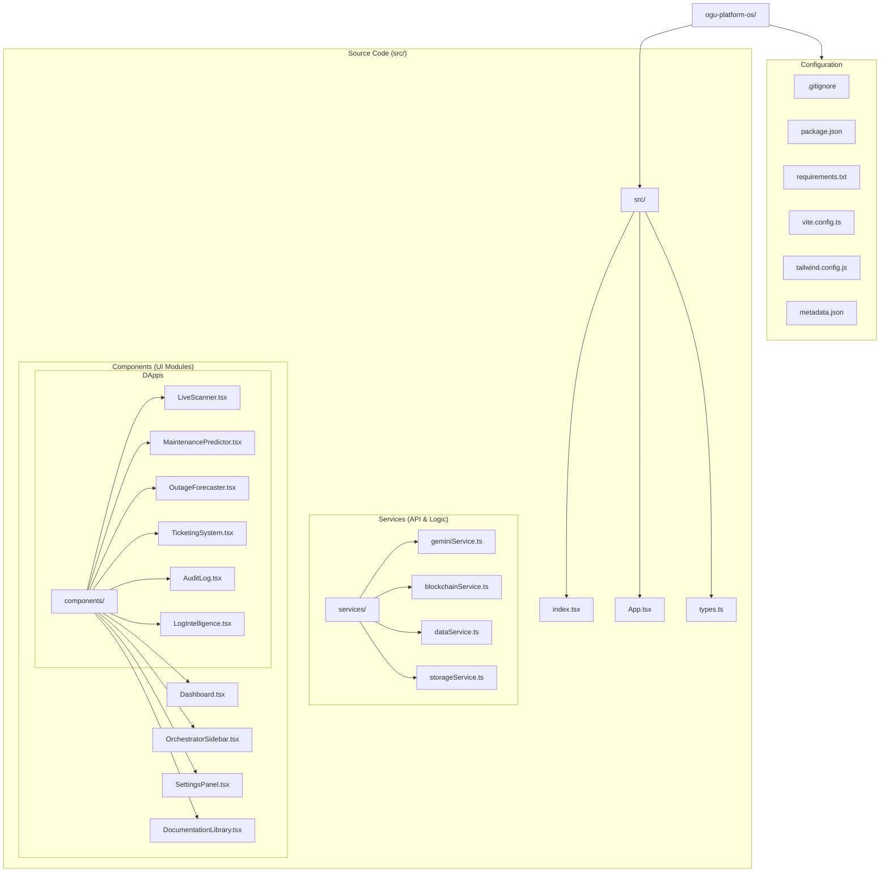
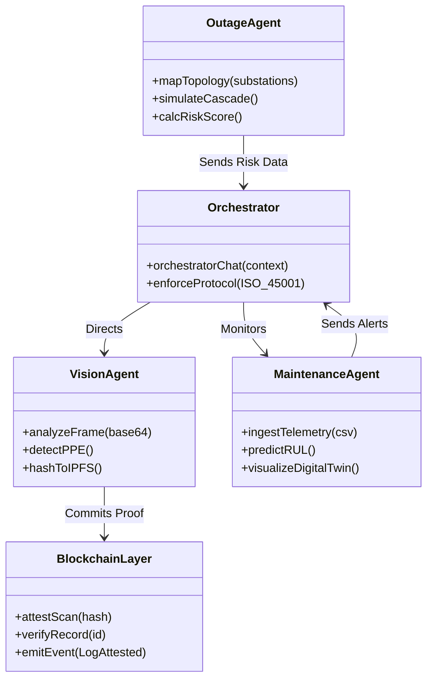

# OGU Platform Architecture & Repository Structure

## Repository Map

## System Architecture

## Orchestrator AI Interface

The Orchestrator Logic resides in `src/services/geminiService.ts`.

**Interface Flow:**
1. **Input:** `OrchestratorSidebar.tsx` captures user command.
2. **Context:** Frontend aggregates `InteractionEvent[]` + `currentApp` state.
3. **Processing:** `GeminiService.orchestratorChat()` constructs a "System Prompt" defining the `OGU_ORCHESTRATOR_CORE` persona.
4. **Execution:** Request sent to Google Gemini 2.5 Flash.
5. **Output:** Response returned as raw text, formatted by UI as system logs.
